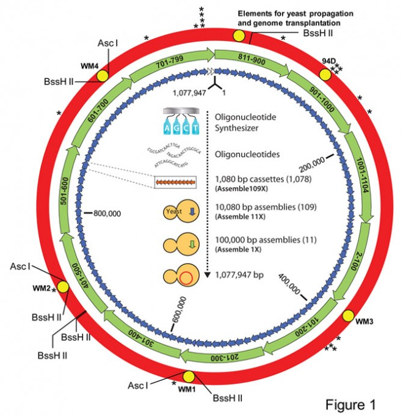

.. vim:ts=4:sw=4:tw=0:wm=0:et;nowrap

=============================================
Synthetic Life -or- The J. Craig Venter Cache 
=============================================

Coordinates
===========

N38 xx.xxx W090 yy.yyy

Short Description
=================

THE CACHE IS NOT AT THE POSTED COORDINATES!

Decode the genome watermark below to locate the cache.

Long Description
================

Sequencing the Human Genome
---------------------------

On September 4, 2007 the sequencing of the complete human genome of an
individual was completed for the first time. The individual, known as *HuRef*,
was the person for whom this cache was named, `J. Craig Venter`__.

.. __: http://en.wikipedia.org/wiki/Craig_Venter

Here is a snippet of `a related site`__ I found interesting:

.. __: http://www.sgidna.com/science.php

    DNA is the software of life. However, instead of being coded in 1s and 0s, the
    biological software is coded with the four chemical components of DNA - A
    (Adenine), T (Thymine), C (Cytosine) and G (Guanine).

    It has been nearly `60 years since the structure of DNA was discovered`__, and
    nearly 20 years since the first complete sequencing of the genome of a
    free-living organism. That first genome ushered in a new era of genome
    sequencing or what is known as “reading” or “digitizing” the genetic code. The
    ability to read digitize biology has allowed scientists to sequence and analyze
    the genomes of tens of thousands of genomes from a variety of species, leading
    to a dramatic increase in the amount of genetic sequence information available.

    Now scientists are using such digital information to actually design and
    synthesize DNA constructs, thus bridging the gap between the digital and the
    biological worlds. Molecular biologists are now like software engineers
    programing the DNA (or operating systems) of cells to perform useful and
    desired functions for multiple applications such as agriculture, medicine,
    energy and food.

.. __: http://www.nobelprize.org/educational/medicine/dna_double_helix/readmore.html

Synthesis of a Living Cell
--------------------------

Subsequently, `Wired Magazine reported`__ several years ago that a
self-replicating cell had been synthesized.

.. __: http://www.wired.com/wiredscience/2010/05/scientists-create-first-self-replicating-synthetic-life/

I came across yet another article recently that detailed further activity by
JCVI, the institute formed by this man, in the `successful synthesizing of a
living cell`__

.. __: http://en.wikipedia.org/wiki/Mycoplasma_mycoides

Watermarks
----------

Included in the genome of this synthesized cell were four *watermarks*:

If you examine the graphic in `Figure 1`

    Figure 1: Artificial Cell Diagram

you can see the locations within the synthesized cell of four items marked "WM1
through WM4".  These *watermarks* encode the following items:

    - Code table for entire alphabet with punctuations
    - Names of 46 contributing scientists
    - Three quotations
    - The web address for the cell.

The first of these watermarks, the Code Table, is shown below, without its
normally accompanying prefix and postfix sequences (used to identify the bounds
of the watermark) and formatted for convenience::

    GTTCGAATATTTCTATAGCTGTACATATTGTAATGCTGATAACTAATA
    CTGTGCGCTTGACTGTGATCCTGATAAATAACTTCTTCTGTAGGGTAG
    AGTTTTATTTAAGGCTACTCACTGGTTGCAAACCAATGCCGTACATTA
    CTAGCTTGATCCTTGGTCGGTCATTGGGGGATATCTCTTACTAATAGA
    GCGGCCTATCGCGTATTCTCGCCGGACCCCCCTCTCCCACACCAGCGG
    TGTAGCATCACCAAGAAAATGAGGGGAACGGATGAGGAACGAGTGGGG
    GCTCATTGCTGATCATAATGACTGTTTATATACTAATGCCGTCAACTG
    TTTGCTGTGATACTGTGCTTTCGAGGGCGGGAGATTCGTTTTTGACAT
    ACATAAATATCATGACAAAACAGCCGGTCATGACAAAACAGCCGGTCA
    TAATAGATTAGCCGGTGACTGTGAAACTAAAGCTACTAATGCCGTCAA
    TAAATATGATAATAGCAACGGCACTGACTGTGAAACTAAAGCCGGCAC
    TCATAATAGATTAGCCGGAGTCGTATTCATAGCCGGTAGATATCACTA
    TAAGGCCCAGGATCATGATGAACACAGCACCACGTCGTCGTCCGAGTT
    TTTTTGCTGCGACGTCTATACCACGGAAGCTGATCATAAATAGTTTTT
    TTGCTGCGGCACTAGAGCCGGACAAGCACACTACGTTTGTAAATACAT
    CGTTCCGAATTGTAAATAATTTAATTTCGTATTTAAATTATATGATCA
    CTGGCTATAGTCTAGTGATAACTACAATAGCTAGCAATAAGTCATATA
    TAACAATAGCTGAACCTGTGCTACATATCCGCTATACGGTAGATATCA
    CTATAAGGCCCAGGACAATAGCTGAACTGACGTCAGCAACTACGTTTA
    GCTTGACTGTGGTCGGTTTTTTTGCTGCGACGTCTATACGGAAGCTCA
    TAACTATAAGAGCGGCACTAGAGCCGGCACACAAGCCGGCACAGTCGT
    ATTCATAGCCGGCACTCATGACAAAACAGCGG

which translates to::

    J. CRAIG VENTER INSTITUTE 2009
    ABCDEFGHIJKLMNOPQRSTUVWXYZ
     0123456789#@)(-+\=/:<;>$&}{*]"[%!'.,
    SYNTHETIC GENOMICS, INC.
    <!DOCTYPE HTML><HTML><HEAD><TITLE>GENOME TEAM</TITLE></HEAD><BODY><A HREF="HTTP://WWW.JCVI.ORG/">THE JCVI</A>
PROVE YOU'VE DECODED THIS WATERMARK BY EMAILING US <A HREF="MAILTO:MROQSTIZ@JCVI.ORG">HERE!</A>
</BODY></HTML>
    
A Fifth Watermark?
------------------

I think I have found an undocumented *fifth* watermark in the genome of *M.
Mycoides*; here is the sequence of nucleobases I have discovered::

    TGATCACTGGCTATACAACTGTACTCATGAATATCATAGTTGTAAATA
    AGTTAATAATGCATATGATCATAAATATTTCGTTGCTGATAATGCTGA
    GCTATACGTGGCATATGATCATAAATAGGCCTGGGCTGATCAATAGTC
    TAGTGATAACTACAATAGCTAGCACGACGACGAATAAGTTCCTGAATA
    CTGTGCATACTATAATAGAACCTGTGACATATACTGTGAATACTGGCT
    ATATGACGTTGATAGAACAACCATATAAGTCGTTACTCCGCTGTGATA
    TAGGCTATATGATCATAACATATAGCTTAGCATATACGTTGCATAGCT
    TTTCTGTAATGCTTTTAAATATGATAGAACGCAATATTATCCCTGTGG
    ATACCACCACCAATAATTCTGATTATACATCGTTCCATAGGCCTGTGC
    ATTATATGATCATAAATAATTTAATTTCGTATTTAACTAATATAGTGA
    ATATCATGATGAACACAGCACCACGTCGTCGTCCGAGCTTACCTGATT
    TGCTAGCGATTTCGTCAACACTGACTATAGTGCGCTAACTAGTGACGT
    CTACGAACATCAACAATACCACCACCAATATGATCATAAATATACTAA
    CGTTTTTAGTTTTCATAAATACTGGCTATATCACTGATTATTTAATGC
    ATATAGTGAATATGCAATCGCATACTTACTCGAAATAGAGCGATAGTC
    TCTGTACTTATAGCGAGACGAAATACTCTTATACCACCACCAATATAC
    CGTCGTATTATAAACTCCTTTGCAGAGATACTACGTTAAAACGCTTTT
    TCA

Your job is now to decode this sequence -- and locate and log the cache!

Hint
====

There is a clue or two in the description -- and at least two ways to solve the
puzzle.
