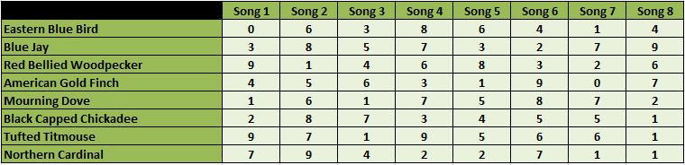
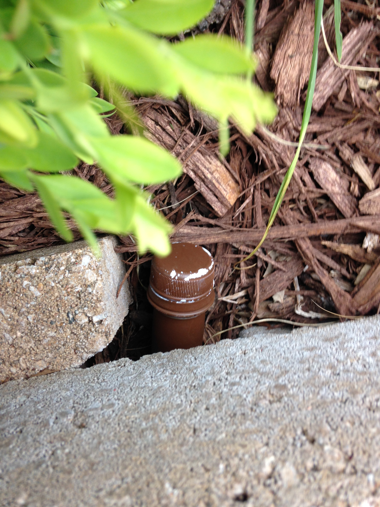

==================================
PUZZLE CACHE SOLUTIONS FOR RAINMAN
==================================

:author: Robert Oelschlaeger (roelsch)
:contact: roelschlaeger@gmail.com
:revision: 1.0
:date: 19 July 2016

.. contents:: Table of Contents
    :backlinks: entry

.. sectnum::

.. raw:: html

    

----

`GC1HNNQ`_ Fried Ornithology
============================

.. _GC1HNNQ : http://coord.info/GC1HNNQ

The trick to this one was to listen to the songs....

Sure, it isn't much fun, but eventually you come up with these answers:

.. raw:: html

    

::

    Song 1 Eastern Blue Bird
    Song 2 Blue Jay
    Song 3 Mourning Dove
    Song 4 Tufted Titmouse
    Song 5 American Gold Finch
    Song 6 Northern Cardinal
    Song 7 Black Capped Chickadee
    Song 8 Red Bellied Woodpecker

    Picture A Red Bellied Woodpecker
    Picture B American Gold Finch
    Picture C Mourning Dove
    Picture D Eastern Blue Bird
    Picture E Cardinal
    Picture F Tufted Titmouse
    Picture G Black Capped Chickadee
    Picture H Blue Jay

    http://www.allaboutbirds.org/guide/Eastern_Bluebird/sounds etc.

.. raw:: html

    

Matching those results against the table:

I got these results:

.. raw:: html

    

::

    A=6
    B=1
    C=1
    D=0
    E=7
    F=9
    G=5
    H=8

    N 38° 3A.BCD W 092° 1E.FGH
    N 38° 36.110 W 092° 17.958

.. raw:: html

    

`GC2HDZM`_ 3 out of 5
=====================

.. _GC2HDZM: http://coord.info/GC2HDZM

The trick to this one is to look at your standard QWERTY keyboard.

    1. Take three consecutive letters from ciphertext

    2. Note that they fall in a straight line on the keyboard

    3. What letter is either "next" or "missing" from the sequence? That's the cleartext character.

.. raw:: html

    

::

    9ij n  <-- 'n' is next in the sequence 'nij'
    0km o  <-- 'o' is missing from the sequence '0km'
    4fv r  <-- 'r' is missing from the sequence '4fv'
    5gb t
    6yn h
    4ez s
    -l, p
    1qz a
    3ed c
    3dc e
    edc 3
    uhb 8
    5rx d
    3dc e
    5tb g
    4fv r
    3dc e
    3dc e
    4ez s
    4ez s
    -l, p
    1qz a
    3ed c
    3dc e
    edc 3
    edc 3
    -l, p
    0km o
    9jn i
    9ij n
    5gb t
    ijn 9
    qaz 1
    rfv 4
    7uj m
    9jn i
    9ij n
    8hb u
    5gb t
    3dc e
    4ez s
    2sx w
    3dc e
    4ez s
    5gb t
    4ez s
    -l, p
    1qz a
    3ed c
    3dc e
    okm 0
    ijn 9
    wsx 2
    5rx d
    3dc e
    5tb g
    4fv r
    3dc e
    3dc e
    4ez s
    4ez s
    -l, p
    1qz a
    3ed c
    3dc e
    wsx 2
    okm 0
    -l, p
    0km o
    9jn i
    9ij n
    5gb t
    qaz 1
    wsx 2
    tfc 6
    7uj m
    9jn i
    9ij n
    8hb u
    5gb t
    3dc e
    4ez s
    zzz
    z

.. raw:: html

    

This results in::

    northspace38degreesspace33point914minuteswestspace092degreesspace20point126minutes??

which translates to::

    N38° 33.914  W92° 20.126

which Geochecker tells you:

.. raw:: html

    

::

    · 3 out of 5 ·
    · GC2HDZM ·

    N 38° 33.914  W 92° 20.126

    Success!

.. raw:: html

    

`GC3N3NY`_ Drawing a Blanc
==========================

.. _GC3N3NY: http://coord.info/GC3N3NY

Here's what I got from listening to the audio and a bit of Googling:

.. raw:: html

    

::

    A = Wile E Coyote
    http://www.imdb.com/character/ch0029626/quotes

    B = Sylvester the Cat
    http://www.movie-dialog.com/looney-looney-looney-bugs-bunny-movie/then-one-day-the-end-of-the-road

    C = Marvin the Martian
    http://en.wikipedia.org/wiki/Marvin_the_Martian

    D = Pepe le Pew

    E = Foghorn Leghorn

    F = Barney Rubble

    G = Yosemite Sam
    http://www.imdb.com/title/tt0082679/quotes

    Y = Cosmo S. Spacely
    http://www.imdb.com/character/ch0000623/

    ====
    A = 4
    B = 9
    C = 6
    D = 4
    E = 7
    F = 6
    G = 8/3? == could be Yosemite or Sam
    Y = 5

    H = Voice C - Voice D = 6 - 4 = 2
    Z = Voice A x Voice Y = 4 * 5 = 20

    Know that parking is easily passed on the road and the entrance may be found
    at N 38° 54.DGC W 92° Z.FGE.

    The geocache itself is concealed here: N 38° 54.ABH W 92 Z.EFG.
    ====

    Parking:
    N38 54.DGC W92  Z.FGE
    N38 54.486 W92 20.687 <== this looks good for the entrance to the parking area

    Geocache:
    N38 54.ABH W92  Z.EFG
    N38 54.492 W92 20.768

    ====

    If you take "Yosemite" as a first name, you get the values shown above. The
    parking lot entrance coordinates seem to corroborate the value.

.. raw:: html

    

`GC6CKHJ`_ Dots
===============

.. _GC6CKHJ: http://coord.info/GC6CKHJ

Nothing in the cache description said that the cache is anywhere other than at
the posted location. After testing about 60 possible answers, I came to this
astounding conclusion and then tested it on GeoChecker.

.. raw:: html

    

::

    Congratulations - your solution is correct!!!
    Cache Name: Dots
    GC Code: GC6CKHJ

    Coordinate:
    N 38°54.606  W 092°19.602

.. raw:: html

    

The coordinates take you to the landscaping blocks around the sign for the Red
Oak Plaza mall. We parked on the west side, walked directly to the blocks,
reached over and and down... and felt the end of the brown-painted preform where
it was tucked in a hole between the blocks.

`GC2QDWG`_ It's Sepia
=====================

.. _GC2QDWG: http://coord.info/GC2QDWG

I got some help from Atomic Goats Breath on this one:

::

    David Bassett
    7:24 PM (1 hour ago)

    to me

    I hope this helps, it's the page from when I worked it. I don't really find
    counting pixels all that exciting so I haven't worked too many of these
    colors, and I guess nobody has solved maple wood so good luck with that one.
    If you get it you deserve the ftf.

    If I can ever help you can reach me at 573.489.0350
    Goat

    ====

He sent along a picture, annotated with the circle radii, in pixels

.. image:: photo.jpg
    :alt: Annotated photo for GC2QDWG It's Sepia
    :width: 60%
    :align: center

with these results

::

    38 90 87 ==> 38.9087 ==> N38 54.522

    92 33 52 ==> 92.3352 ==> W92 20.112

    N38 54.522 W92 20.112

Checking with GeoChecker, I got

.. raw:: html

    

::

    · It's Sepia (GC2QDWG) ·
    N 38° 54.522  W 92° 20.112

    Success!

    Whoohoo! Yipee! uh-huh, uh-huh! w00t! Yeah, baby!

    Now, go get it!

.. raw:: html

    

Summary
=======

.. table:: **Cache Location Summary Table**

     ========= =================== ============== ===============
     GC        Cache Name          Latitude       Longitude
     ========= =================== ============== ===============
     GC1HNNQ_  Fried Ornithology   N 38° 36.110   W 092° 17.958
     --------- ------------------- -------------- ---------------
     GC2HDZM_  3 out of 5          N 38° 33.914   W 092° 20.126
     --------- ------------------- -------------- ---------------
     GC3N3NY_  Drawing a Blanc     N 38° 54.492   W 092° 20.768
     --------- ------------------- -------------- ---------------
     GC6CKHJ_  Dots                N 38° 54.606   W 092° 19.602
     --------- ------------------- -------------- ---------------
     GC2QDWG_  It's Sepia          N 38° 54.522   W 092° 20.112
     ========= =================== ============== ===============

